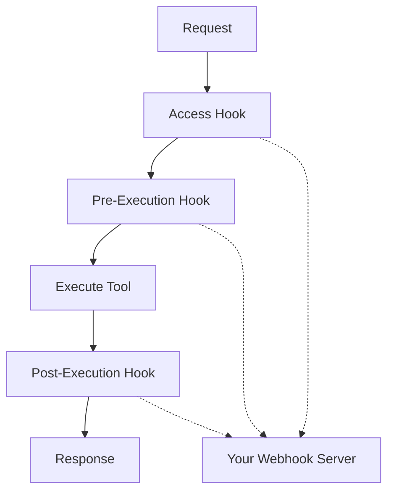

import { Cards } from "nextra/components";

# Logic Extensions

Logic Extensions let you plug external systems into the Arcade Engine to control which tools users can see, validate and modify tool requests before execution, and filter or transform tool responses afterwards.

You deploy a webhook server that implements the Logic Extensions contract, then connect it to the Arcade Engine through the Dashboard. Your logic runs at predefined **hook points** in the tool lifecycle — no changes to your tools or agents required.

## Why use Logic Extensions?

- **Access control** — Delegate "can this user see/use this tool?" to your IDP or entitlement system
- **Request validation** — Enforce policies before execution (e.g., block certain domains, require org-scoped inputs)
- **Payload modification** — Enrich inputs, inject secrets, redact PII from outputs, or filter content
- **Audit and compliance** — Route all tool interactions through your security and logging infrastructure

## How it works

The Engine defines three hook points in the tool execution flow. At each point you configure, the Engine calls out to your webhook server and acts on the response:

| Hook point | When it runs | What it can do |
| --- | --- | --- |
| **Access Hook** | When listing tools for a user | Allow or deny tools the user can see |
| **Pre-Execution Hook** | Before each tool execution | Allow, deny, or modify inputs and secrets |
| **Post-Execution Hook** | After tool execution | Allow, deny, or modify the output |

## Get started

<Cards>
  <Cards.Card
    title="How Hooks Work"
    href="/guides/logic-extensions/how-hooks-work"
  />
  <Cards.Card
    title="Run an Extension"
    href="/guides/logic-extensions/examples"
  />
  <Cards.Card
    title="Build Your Own"
    href="/guides/logic-extensions/build-your-own"
  />
  <Cards.Card
    title="API Reference"
    href="/references/logic-extensions-api"
  />
</Cards>
