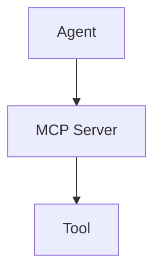
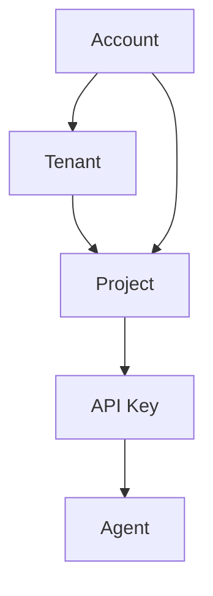
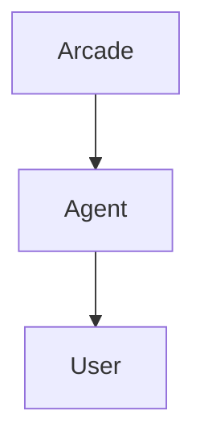
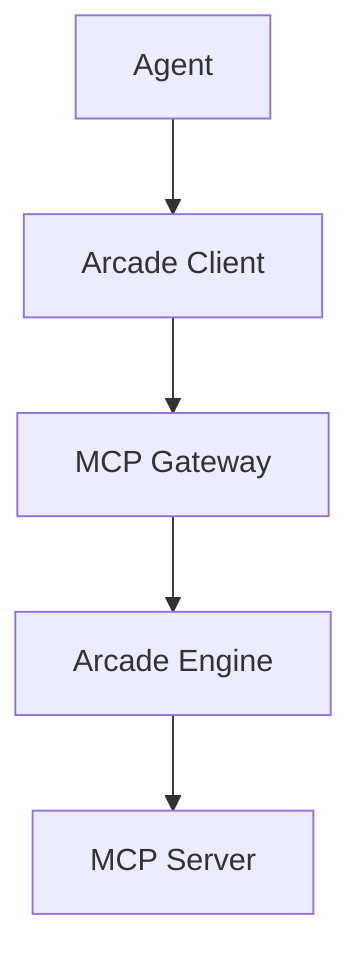

# Arcade Glossary

## Agents and Tools



### Agent

An 'agent' is the application you are building. It can be a chatbot, a web application, a mobile app, or any other type of application that happens to use an LLM as part of its functionality. Agents interact with the world by calling tools. Helping you build, test, authenticate, and deploy tools is what Arcade is all about.

### Context

A 'Context' is an object that is passed to a tool as a parameter when the tool is executed. It contains information about the tool call, the user for which the tool is being called, and any secrets the tool requires to run.

_Learn more about [context](/guides/create-tools/tool-basics/runtime-data-access)._

### Entrypoint File

An 'Entrypoint file' is necessary when building your own MCP servers with Arcade. An entrypoint file creates and runs an `MCPApp` when invoked directly.

The following is a minimal example of an entrypoint file:

```python filename="server.py" showLineNumbers
from arcade_mcp_server import MCPApp

app = MCPApp()

@app.tool
def echo(phrase: Annotated[str, "The phrase to echo"]) -> str:
    """Echo a phrase"""
    return phrase

if __name__ == "__main__":
    app.run()
```

### MCP Server

An 'MCP Server' is a collection of tools that can be used by an agent, grouped logically together by a common theme or provider, and the running remote process that serves and executes the tools. MCP Servers are the unit of deployment for tools within Arcade.

#### Protected MCP Servers

A protected server implements [MCP authorization](https://modelcontextprotocol.io/specification/2025-06-18/basic/authorization) and requires the MCP client to provide a token identifying the user when calling the MCP server. Examples: servers that require sign-in, deal with private info, call APIs on your behalf

#### Unprotected MCP Servers

An unprotected (anonymous) MCP server can be used by any MCP client on the network. Because it is anonymous, it can't identify the user who is using the server. Examples: servers that return static info, weather APIs, etc

### Tool

A 'tool' is a function that can be called by an agent which performs some action - commonly via an API, filesystem, database, etc. Tools are written in Python and deployed by running a worker which contains the MCP Server's code. Tools are defined by the `@tool()` decorator and will be passed `ToolContext` as the first argument. If a tool has dependencies that are not met (a secret is not provided, for example), the tool will fail to execute.

Tools are commonly referred to by a qualified name that includes their MCP Server. For example, [Gmail.SendEmail](/resources/integrations/productivity/gmail#gmailsendemail)

_Learn more about [tools](/guides/create-tools/tool-basics/build-mcp-server)._

#### Optimized tools

[Optimized tools](/guides/create-tools/improve/types-of-tools#optimized-tools) are designed from scratch to provide the best performance for LLMs in terms of speed, reliability, accuracy, and cost-effectiveness.

#### Starter tools

[Starter tools](/guides/create-tools/improve/types-of-tools#starter-tools) are designed to mirror the original HTTP API design of the upstream service. They are not optimized for LLM usage and are not subject to evaluation suites. We recommend thoroughly evaluating each Starter tool with your Agents or chatbots before using it in production.

Understand why [LLMs usually perform poorly](/guides/create-tools/improve/types-of-tools#why-llms-perform-poorly-when-calling-http-apis) when calling HTTP APIs.

### Tool Context

'Tool context' is an object that is passed to a tool as a parameter when the tool is executed. It contains information about the tool call, the user for which the tool is being called, and any secrets the tool requires to run.

_Learn more about [tool context](/guides/create-tools/tool-basics/runtime-data-access)._

### Transport Modes

MCP servers can communicate with clients through different transport mechanisms. Each transport is optimized for specific use cases and client types.

The stdio (standard input/output) transport is used for direct client connections. It is ideal for desktop applications (Claude, VS Code, Cursor) and command-line tools.

The HTTP transport provides REST/SSE endpoints for web-based clients. It is the default transport mode and is used for most clients.

_Learn more about [transport modes in the MCP Protocol documentation](https://modelcontextprotocol.info/docs/concepts/transports/)._

### MCP (Model Context Protocol)

MCP is an open standard protocol that enables LLMs to access and use tools and data sources. Arcade tools go further than MCP with enterprise-grade authentication, secure token management, and fine-grained permissions. This allows your tools to be accessible to any LLM that supports MCP, while maintaining security and user privacy.

Arcade Tools can be presented as an MCP server (via the Arcade Engine), allowing any LLM that supports MCP to access your tools. In the future, you will be able to add remote MCP servers to your project as additional workers, making their tools available to your agents.

## The Arcade Platform



### Account

The 'account' is you (or your teammates), the developer(s) who are using Arcade to build an application or agent. You can sign into the Arcade dashboard, manage projects, and more.

### Tenant

A 'tenant' is a collection of projects with unified billing details. It is the top-level unit of organization in Arcade. You can be a member of one or more tenants, and each tenant can have multiple projects.

### Project

A 'project' is a collection of agents and tools. It is smallest unit of organization and isolation in Arcade. You can have multiple projects, and each project can have multiple agents and tools. Accounts can be members of multiple projects, and each project will have different API keys.

### API Key

An 'API key' is a secret key that is used to authenticate requests to the Arcade API. It is used to identify the project that the request is for. API keys are project-specific.

## Authentication and Billing



### User

A 'user' is your end-user, the person who is using your application or agent. Users are counted by the unique `user_id` properties sent when calling tools. `user_id` values are commonly email addresses, but can be any string or number.

### Monthly Active Users (MAU)

Monthly Active Users are the unique end-users (counted by `user_id`) who have executed a tool in your app/agent within the past month. If the same `user_id` calls a tool multiple times in the same month, or executes multiple tools, that `user_id` is only counted once when calculating MAU.

### User Challenges

User Challenges are the count of authorizations performed for any user (specified by `user_id` in Arcade's SDKs and APIs). Authorization challenges occur when a user needs a new permission or scope that they don't currently have, including previously-held scopes that were deleted or expired. The same user authenticating to multiple MCP Servers will have a User Challenge for each MCP Server (e.g. once for Slack and once for Google). We also count the act of elevating permissions to a user who has already authenticated to a MCP Server (e.g. adding a "write" scope when they previously only had a "read" scope).

### Auth Provider

An 'auth provider' is a service that your users sign in with to let the agent access their data or take actions on their behalf. This can be a hosted service like Google or Slack, or a custom OAuth provider. Multiple MCP Servers may share the same auth provider (for example, Gmail and Google Drive both use Google's OAuth provider). Custom auth providers are defined in the Arcade Dashboard, or in your Engine YAML if you're self-hosting.

_Learn more about [auth providers](/references/auth-providers)._

### Authorization Scope

An 'authorization scope' is a permission that a user can grant to an agent. This is used to control what the agent can do with the user's data. Available authorization scopes are defined by the authentication provider, and each tool defines the scopes it requires.

Learn more about [authorized tool calling](/guides/tool-calling/custom-apps/auth-tool-calling).

### Tool Executions

A 'tool execution' is a single call to a tool to interact with a remote system or service. The tool execution itself may fail (e.g. the user does not have permission to call the tool), but as long as the execution was able to be routed to a worker, it will be counted.

_Learn more about [tool executions](/guides/tool-calling)._

### Standard and Pro Tool executions

Arcade tools are divided into 2 categories: Standard and Pro. While all tools have some cost for Arcade to run, Pro tools are significantly more costly - either due to infrastructure costs, the complexity of the tool, or a cost imposed by the provider of the tool. Pro tools cost more to execute and have different limits.

Learn more about tool pricing [here](https://www.arcade.dev/pricing).

### Bring Your Own Credentials (BYOC)

Bring Your Own Credentials (BYOC) is a feature that allows you to use your own credentials to certain pro tools. This changes the cost of the tool execution, as you will be charged directly by the provider of the tool, rather than relying on Arcade to pay the bill for you.

To set your own credentials, set the requisite secret within the Arcade Dashboard, overwriting the default 'static' credentials.

## Tool Execution and Tool Development



### Arcade Client

The 'Arcade client' is the SDK that you use to interact with the Arcade platform. It is how your agent lists and calls tools, tied back to your project via an API key. We offer clients for many popular languages and frameworks, including Python, JavaScript, and more.

_Learn more about [the Arcade clients](/references)._

### Arcade Engine

The Arcade Engine is the core of the Arcade platform. It is responsible for routing tool execution requests to the correct MCP server, managing the lifecycle of tool executions, and for enforcing security and authorization decisions.

The Arcade Engine is also responsible for the OAuth flow for your agent's users. This includes granting and elevating permissions and keeping tokens fresh.

### MCP Gateway

MCP Gateways are a feature of the Arcade Engine that allows you to add and combine multiple MCP servers in your project. It allows your clients to speak MCP directly to Arcade and get all the functionality you'd expect from the Arcade Engine. The MCP Gateway is responsible for routing tool execution requests to the correct MCP server, and for enforcing security and authorization decisions. You can mix and match tools from different MCP servers in the same project, and not all tools from a MCP server need to be available to the same agent or LLM.

### Arcade MCP (Server Development Kit)

Arcade MCP is the secure framework for building MCP servers. It is responsible for the lifecycle of tool executions, and for enforcing security and authorization decisions within the boundary of the server.

### Evaluations (Evals)

Evaluations are a way to test the LLMs' ability to select and call your tools. Arcade's eval suite can and should be run as part of the development process to ensure your tools are working as expected.

_Learn more about evaluations [here](/guides/create-tools/evaluate-tools/why-evaluate)._
