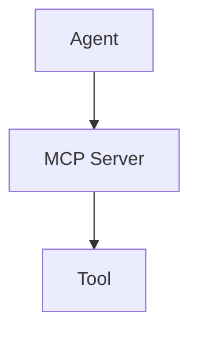
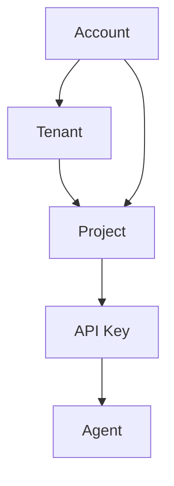
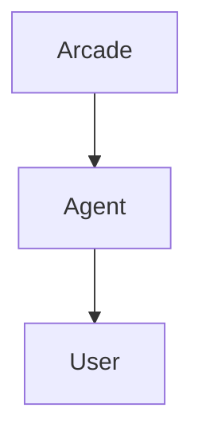
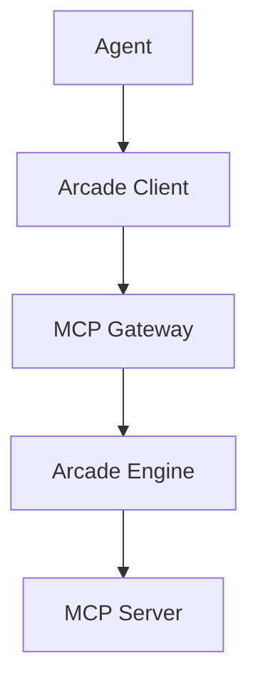

# Arcade Glossary

This glossary defines key terms used throughout Arcade documentation and the platform.

## Agents and Tools



### Agent

An agent is the intelligent application you are building. It can be a chatbot, a web application, a mobile app, or any other type of application that happens to use an LLM as part of its capability. Agents interact with the world by calling tools. Helping you build, test, authenticate, and deploy tools is what Arcade is all about.

### Harness

A harness is the application that runs the agent. The agent determines the prompt, the tools, and the policies for every interaction. The harness is the software "glue" that determines _how_ all of these components work together. Are tools called over MCP? Does the system open OAuth URLs in browsers? Can the agent access bash commands in the terminal? The harness handles all of these details.

### ReAct Agent

This (Reason + Act) is the most common agentic pattern, where an LLM runs in a loop, with the option to call tools to perform actions or retrieve information into its context. The initial input is a system prompt together with a user prompt. The agent may then iteratively call tools and update its context until it generates a response that does not involve a tool call.

### Context

A context is an object that a tool receives as a parameter when the tool executes. It contains information about the tool call, the user for which you call the tool, and any secrets the tool requires to run.

_Learn more about [context](/guides/create-tools/tool-basics/runtime-data-access)._

### Entrypoint File

An entrypoint file is necessary when building your own MCP servers with Arcade. An entrypoint file creates and runs an `MCPApp` when invoked directly.

The following is a minimal example of an entrypoint file:

```python filename="server.py" showLineNumbers
from arcade_mcp_server import MCPApp

app = MCPApp()

@app.tool
def echo(phrase: Annotated[str, "The phrase to echo"]) -> str:
    """Echo a phrase"""
    return phrase

if __name__ == "__main__":
    app.run()
```

### MCP server

An MCP server is a collection of tools that an agent can use, grouped logically together by a common theme or provider, and the running remote process that serves and executes the tools. MCP servers are the unit of deployment for tools within Arcade.

#### Protected MCP servers

A protected server implements [MCP authorization](https://modelcontextprotocol.io/specification/2025-06-18/basic/authorization) and requires the MCP client to provide a token identifying the user when calling the MCP server. Examples: servers that require sign-in, deal with private info, call APIs on your behalf

#### Unprotected MCP servers

An unprotected (anonymous) MCP server allows any MCP client on the network to use it. Because it is anonymous, it can't identify the user who uses the server. Examples: servers that return static info, weather APIs, etc

### tool

A tool is a function that an agent can call which performs some action - commonly via an API, filesystem, database, etc. tools function with Python and deploy by running a worker which contains the MCP server's code. The `@tool()` decorator defines tools and passes `ToolContext` as the first argument. If a tool has dependencies that fail (when you don't provide a secret, for example), the tool will fail to execute.

tools are commonly referred to by a qualified name that includes their MCP server. For example, [Gmail.SendEmail](/resources/integrations/productivity/gmail#gmailsendemail)

_Learn more about [tools](/guides/create-tools/tool-basics/build-mcp-server)._

#### Optimized tools

[Optimized tools](/guides/create-tools/improve/types-of-tools#optimized-tools) provide the best performance for LLMs in terms of speed, reliability, accuracy, and cost-effectiveness.

#### Unoptimized tools

[Unoptimized tools](/guides/create-tools/improve/types-of-tools#unoptimized-tools) mirror the original HTTP API design of the upstream service. They are not optimized for LLM usage and are not subject to evaluation suites. Thoroughly evaluate each Unoptimized tool with your Agents or chatbots before using it in production.

Understand why [LLMs perform poorly when](/guides/create-tools/improve/types-of-tools#why-llms-perform-poorly when-calling-http-apis) calling HTTP APIs.

### Tool context

A tool context is an object that the system passes to a tool as a parameter when the tool executes. It contains information about the tool call, the user for which you call the tool, and any secrets the tool requires to run.

_Learn more about [tool context](/guides/create-tools/tool-basics/runtime-data-access)._

### Transport modes

MCP servers can communicate with clients through different transport mechanisms. Each transport optimizes for specific use cases and client types.

The stdio (standard input/output) transport connects to clients directly. It is ideal for desktop applications (Claude, VS Code, Cursor) and command-line tools.

The HTTP transport provides REST/SSE endpoints for web-based clients. It is the default transport mode and serves most clients.

_Learn more about [transport modes in the MCP Protocol documentation](https://modelcontextprotocol.info/docs/concepts/transports/)._

### MCP (Model Context Protocol)

MCP is an open standard protocol that enables LLMs to access and use tools and data sources. Arcade tools go further than MCP with enterprise-grade authentication, secure token management, and fine-grained permissions. This allows your tools to be accessible to any LLM that supports MCP, while maintaining security and user privacy.

The system can present Arcade tools as an MCP server (via the Arcade Engine), allowing any LLM that supports MCP to access your tools. In the future, you will be able to add remote MCP servers to your project as additional workers, making their tools available to your agents.

## The Arcade platform



### Account

The account is you (or your teammates), the developers who use Arcade to build an application or agent. You can sign in to the Arcade dashboard, manage projects, and more.

### Tenant

A tenant is a collection of projects with unified billing details. It is the top-level unit of organization in Arcade. You can be a member of one or more tenants, and each tenant can have multiple projects.

### Project

A project is a collection of agents and tools. It is smallest unit of organization and isolation in Arcade. You can have multiple projects, and each project can have multiple agents and tools. Accounts can be members of multiple projects, and each project will have different API keys.

### Arcade API

The Arcade API is a set of endpoints that allow you to interact with the Arcade platform. You can use the API to call tools, get tool definitions, manage user authorization, and more. See the [Arcade API Reference](/references/api) for more details.

### API key

An API key is a secret key that authenticates requests to the Arcade API. It identifies the project that the request is for. API keys are project-specific.

## Authentication and billing



### User

A user is your end-user, the person who uses your application or agent. The system counts users by the unique `user_id` properties sent when calling tools. `user_id` values are commonly email addresses, but can be any string or number.

### Monthly Active Users (MAU)

Monthly Active Users are the unique end-users (counted by `user_id`) who have executed a tool in your app/agent within the past month. If the same `user_id` calls a tool multiple times in the same month, or executes multiple tools, the system counts that `user_id` only once when calculating MAU.

### User challenges

User challenges count the authorizations performed for any user (specified by `user_id` in Arcade's SDKs and APIs). Authorization challenges occur when a user needs a new permission or scope that they don't currently have, including previously held scopes that expired or were deleted. The same user authenticating to multiple MCP servers will have a user challenge for each MCP server (for example once for Slack and once for Google). This also counts elevating permissions for a user who has already authenticated to a MCP server (for example adding a "write" scope when they previously only had a "read" scope).

### auth provider

An auth provider is a service that your users sign in with to let the agent access their data or take actions on their behalf. This can be a hosted service like Google or Slack, or a custom OAuth provider. Multiple MCP servers may share the same auth provider (for example, Gmail and Google Drive both use Google's OAuth provider). The system defines custom auth providers in the Arcade Dashboard, or in your Engine YAML if you're self-hosting.

_Learn more about [auth providers](/references/auth-providers)._

### Authorization scope

An authorization scope is a permission that a user can grant to an agent. This controls what the agent can do with the user's data. The authentication provider defines available authorization scopes, and each tool defines the scopes it requires.

Learn more about [authorized tool calling](/guides/tool-calling/custom-apps/auth-tool-calling).

### Tool executions

A tool execution is a single call to a tool to interact with a remote system or service. The tool execution itself may fail (for example the user does not have permission to call the tool), but as long as the system can route the execution to a worker, it will count the execution.

_Learn more about [tool executions](/guides/tool-calling)._

### Standard and Pro tool executions

The system divides Arcade tools into 2 categories: Standard and Pro. While all tools have some cost for Arcade to run, Pro tools cost considerably more - either due to infrastructure costs, the complexity of the tool, or a cost imposed by the provider of the tool. Pro tools cost more to execute and have different limits.

Learn more about tool pricing [here](https://www.arcade.dev/pricing).

### Bring Your Own Credentials (BYOC)

Bring Your Own Credentials (BYOC) is a feature that allows you to use your own credentials to certain pro tools. This changes the cost of the tool execution, as you will incur direct charges from the provider of the tool, rather than relying on Arcade to pay the bill for you.

To set your own credentials, set the requisite secret within the Arcade Dashboard, overwriting the default 'static' credentials.

## Tool execution and tool development



### Arcade client

The Arcade client is the SDK that you use to interact with the Arcade platform. It is how your agent lists and calls tools, tied back to your project via an API key. Arcade offers clients for many popular languages and frameworks, including Python, JavaScript, and more.

_Learn more about [the Arcade clients](/references)._

### Arcade Engine

The Arcade Engine is the core of the Arcade platform. It routes tool execution requests to the correct MCP server, manages the lifecycle of tool executions, and enforces security and authorization decisions.

The Arcade Engine also handles the OAuth flow for your agent's users. This includes granting and elevating permissions and keeping tokens fresh.

### MCP gateway

MCP gateways are a feature of the Arcade Engine that allows you to add and combine multiple MCP servers in your project. It allows your clients to speak MCP directly to Arcade and get all the capability you'd expect from the Arcade Engine. The MCP gateway routes tool execution requests to the correct MCP server, and enforces security and authorization decisions. You can mix and match tools from different MCP servers in the same project, and not all tools from a MCP server need to be available to the same agent or LLM.

### Arcade MCP (Server Development Kit)

Arcade MCP is the secure framework for building MCP servers. It manages the lifecycle of tool executions, and enforces security and authorization decisions within the boundary of the server.

### Evaluations (Evals)

Evaluations test the LLMs' ability to select and call your tools. You can and should run Arcade's eval suite as part of the development process to ensure your tools work as expected.

_Learn more about evaluations [here](/guides/create-tools/evaluate-tools/why-evaluate)._