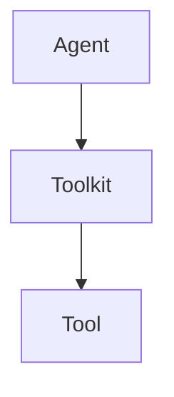
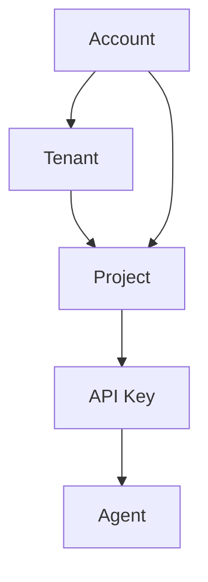
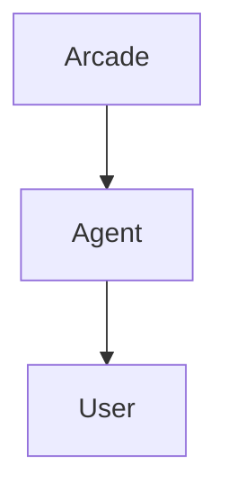
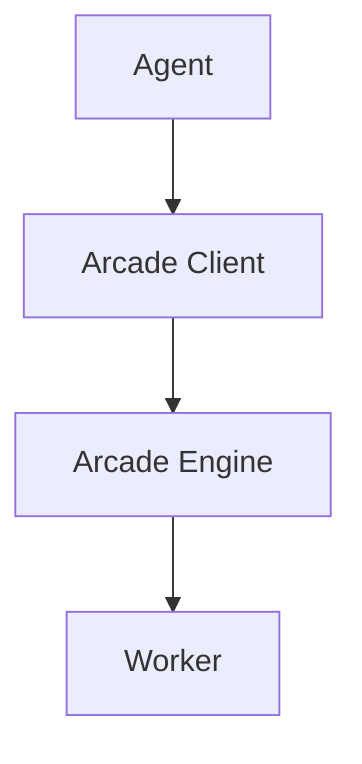

# Arcade Glossary

## Agents and Tools

### Agent

An 'agent' is the application you are building.  It can be a chatbot, a web application, a mobile app, or any other type of application that happens to use an LLM as part of its functionality.  Agents interact with the world by calling tools.  Helping you build, test, authenticate, and deploy tools is what Arcade is all about.

### Toolkit

A 'toolkit' is a collection of tools that can be used by an agent, grouped logically together by a common theme or provider.  Toolkits are the unit of deployment for tools within Arcade.

### Tool

A 'tool' is a function that can be called by an agent which performs some action - commonly via an API, filesystem, database, etc.  Tools are written in Python and deployed by running a worker which contains the toolkit's code.  Tools are defined by the `@tool()` decorator and will be passed `ToolContext` as the first argument.  If a tool has dependencies that are not met (a secret is not provided, for example), the tool will fail to execute.

Tools are commonly referred to by a qualified name that includes their toolkit. For example, [Gmail.SendEmail](https://docs.arcade.dev/toolkits/productivity/gmail#gmailsendemail)

*Learn more about [tools](/home/build-tools/create-a-toolkit).*

### Tool Context

'Tool context' is an object that is passed to a tool as a parameter when the tool is executed.  It contains information about the tool call, the user for which the tool is being called, and any secrets the tool requires to run.

*Learn more about [tool context](/home/build-tools/tool-context).*

### MCP (Model Context Protocol)

MCP is an open standard protocol that enables LLMs to access and use tools and data sources. Arcade tools go further than MCP with enterprise-grade authentication, secure token management, and fine-grained permissions. This allows your tools to be accessible to any LLM that supports MCP, while maintaining security and user privacy.

Arcade Tools can be presented as an MCP server (via the Arcade Engine), allowing any LLM that supports MCP to access your tools.  In the future, you will be able to add remote MCP servers to your project as additional workers, making their tools available to your agents.

*Learn more about [MCP and Arcade](/home/mcp-overview).*

## The Arcade Platform

### Account

The 'account' is you (or your teammates), the developer(s) who are using Arcade to build an application or agent. You can sign into the Arcade dashboard, manage projects, and more.

### Tenant

A 'tenant' is a collection of projects with unified billing details.  It is the top-level unit of organization in Arcade.  You can be a member of one or more tenants, and each tenant can have multiple projects.

### Project

A 'project' is a collection of agents and tools.  It is smallest unit of organization and isolation in Arcade.  You can have multiple projects, and each project can have multiple agents and tools.  Accounts can be members of multiple projects, and each project will have different API keys.

### API Key

An 'API key' is a secret key that is used to authenticate requests to the Arcade API.  It is used to identify the project that the request is for.  API keys are project-specific.

## Authentication and Billing

### User

A 'user' is your end-user, the person who is using your application or agent.  Users are counted by the unique `user_id` properties sent when calling tools.  `user_id` values are commonly email addresses, but can be any string or number.

### Monthly Active Users (MAU)

Monthly Active Users are the unique end-users (counted by `user_id`) who have executed a tool in your app/agent within the past month.  If the same `user_id` calls a tool multiple times in the same month, or executes multiple tools, it is only counted once.

### User Challenges

User Challenges are the count of authorizations performed for any user (specified by user_id in Arcade's SDKs and APIs). Authorization challenges occur when a user needs a new permission or scope that they don't currently have, including previously-held scopes that were deleted or expired. The same user authenticating to multiple toolkits will have a User Challenge for each toolkit  (e.g. once for Slack and once for Google). We also count the act of elevating permissions to a user who has already authenticated to a toolkit (e.g. adding a "write" scope when they previously only had a "read" scope).

### Authentication Provider

An 'authentication provider' is a service that your users can authenticate to grant the agent access to their data or to take actions on their behalf.  This can be a hosted service provider like Google or Slack, or it can be a custom OAuth provider.  Multiple Toolkits may share the same authentication provider (e.g. Gmail and Google Drive share the same Google OAuth authentication provider).  Custom authentication providers are defined in the Arcade Dashboard or your Engine YAML if self-hosting.

*Learn more about [authentication providers](/home/auth-providers).*

### Authentication Scope

An 'authentication scope' is a permission that a user can grant to an agent.  This is used to control what the agent can do with the user's data.  Available authentication scopes are defined by the authentication provider, and each tool defines the scopes it requires.

Learn more about [authorized tool calling](/home/auth/auth-tool-calling).

### Tool Executions

A 'tool execution' is a single call to a tool to interact with a remote system or service. The tool execution itself may fail (e.g. the user does not have permission to call the tool), but as long as the execution was able to be routed to a worker, it will be counted.

*Learn more about [tool executions](/home/use-tools/tools-overview).*

### Standard and Pro Tool executions

Arcade tools are divided into 2 categories: Standard and Pro.  While all tools have some cost for Arcade to run, Pro tools are significantly more costly - either due to infrastructure costs, the complexity of the tool, or a cost imposed by the provider of the tool.  Pro tools cost more to execute and have different limits.

Learn more about tool pricing [here](https://www.arcade.dev/pricing).

### Bring Your Own Credentials (BYOC)

Bring Your Own Credentials (BYOC) is a feature that allows you to use your own credentials to certain pro tools.  This changes the cost of the tool execution, as you will be charged directly by the provider of the tool, rather than relying on Arcade to pay the bill for you.

To set your own credentials, set the requisite secret within the Arcade Dashboard, overwriting the default 'static' credentials.

## Tool Execution and Tool Development

### Arcade Client

The 'Arcade client' is the SDK that you use to interact with the Arcade platform.  It is how your agent lists and calls tools, tied back to your project via an API key.  We offer clients for many popular languages and frameworks, including Python, JavaScript, and more.

*Learn more about [the Arcade clients](/home/arcade-clients).*

### Arcade Engine

The Arcade Engine is the core of the Arcade platform.  It is responsible for routing tool execution requests to the correct worker, managing the lifecycle of tool executions, and for enforcing security and authorization decisions.

The Arcade Engine is also responsible for the OAuth flow for your agent's users.  This includes granting and elevating permissions and keeping tokens fresh.

### Worker

A 'worker' is a process that runs all the tools with a toolkit.  Workers are microservices that are called by the Arcade Engine to handle tool execution requests.  Workers are either [deployed to Arcade's infrastructure](https://docs.arcade.dev/home/serve-tools/arcade-deploy) via `arcade deploy`, or run in your own infrastructure.

*Learn more about workers [here](/home/hybrid-deployment/hybrid-worker).* and [here](/home/serve-tools/docker-worker).

### TDK (Tool Development Kit)

The Arcade TDK is a command-line application that helps you create, test, and deploy tools.

*Learn more about the TDK [here](/home/build-tools/create-a-toolkit).*

### Evaluations (Evals)

Evaluations are a way to test the LLMs' ability to select and call your tools.  Arcade's eval suite can and should be run as part of the development process to ensure your tools are working as expected.

*Learn more about evaluations [here](/home/evaluate-tools/why-evaluate-tools).*

