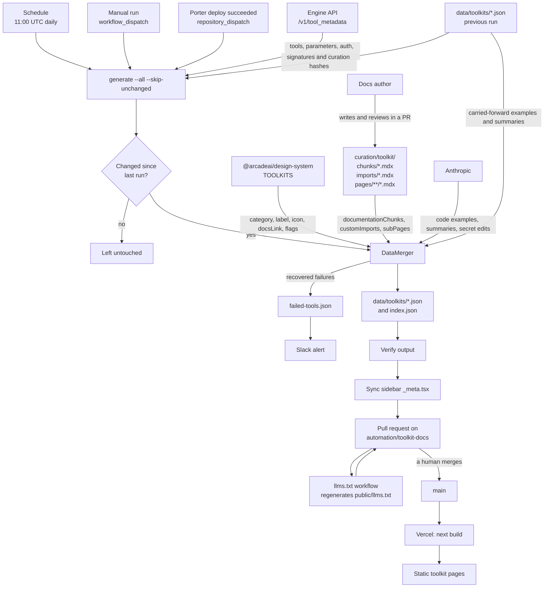

# Toolkit docs generator architecture

This document explains how the toolkit docs generator assembles JSON output and how that output is rendered in the docs site.

## Overview

The generator builds toolkit JSON files from multiple sources and writes them to an output directory. The docs site reads these JSON files and renders them into pages at build time.

The generator does **not** render HTML. It produces structured JSON and optional markdown snippets that the app renders later.

## Data flow

Nothing in this pipeline runs at request time, and nothing reaches the site
without a human merging a pull request.

Each field in a toolkit JSON file comes from exactly one of those inputs. The
Engine API owns everything about a tool, the design system owns everything about
a toolkit's placement and identity, `curation/` owns hand-authored prose, and the
LLM owns code examples and summaries. When a source fails, the merger falls back
to the previous run's file rather than inventing a value, and reports what it
recovered.

`curation/` is the one input a person edits directly. Those Markdown and MDX
files live in this repository and merge like any other change, so a prose edit
reaches the site through the next generation run rather than through a manual
edit of the generated JSON.

Two things the diagram deliberately shows as separate. A second workflow
regenerates `llms.txt` when the data files change, so the generator never writes
it. The sidebar sync writes navigation only, and never touches toolkit JSON.

## Core components

### Data sources

- `EngineApiSource` fetches tool metadata from the Engine API.
- `ArcadeApiSource` fetches tool metadata from the Arcade API.
- `DesignSystemMetadataSource` loads toolkit metadata from `@arcadeai/design-system`.
- `MarkdownCurationSource` compiles documentation chunks, import declarations,
  and subpages from the configured curation directory. When configured, that
  directory is globally authoritative: a missing toolkit directory means the
  toolkit has no authored curation.
- `CombinedToolkitDataSource` merges tools and metadata into one interface.

### Merger

`DataMerger` creates `MergedToolkit` objects by combining tools, metadata, and custom sections.

It also:
- Computes tool signatures for change detection.
- Generates optional tool examples and summaries with LLMs.
- Tracks warnings and failed tools.

### Generator

`JsonGenerator` writes the final output:

- `<toolkitId>.json` for each toolkit
- `index.json` for lookup and metadata

It can also verify output consistency with `OutputVerifier`.

### Diffing

`ToolkitDiff` compares new output to previous output. It reports:
- new toolkits
- removed toolkits
- modified toolkits
- version-only changes

## Rendering in the docs site

The generator output is consumed by the Next.js app:

- The app loads JSON from `toolkit-docs-generator/data/toolkits/`.
- `generateStaticParams` enumerates the toolkit routes and disables unknown dynamic parameters.
- Custom documentation chunks are rendered as MDX in the UI.

If you need HTML output, add a separate build step in the app. The generator intentionally avoids HTML to keep the pipeline deterministic.

## Vercel build

The generator does not run during a Vercel build. The generation workflow commits
the JSON files and navigation changes through a pull request. Vercel then runs the
root `pnpm build` command and compiles the committed files with Next.js.

`app/_lib/toolkit-static-params.ts` enumerates routes from `index.json` and the
per-toolkit files. `app/_lib/toolkit-data.ts` reads the same files for page
rendering and the `/api/toolkit-data/[toolkitId]` route. The root layout no
longer reads request headers — the locale it needs is a hardcoded constant,
since `proxy.ts` redirects every request to an `/en` path — so Vercel can
statically render the toolkit routes at build time from the committed JSON.

## Search indexing

Search uses an external Algolia crawler. There is no Pagefind or local search
index build step in this repository. After deployment, the crawler indexes the
rendered site. `app/_components/algolia-search.tsx` queries that index with the
public, read-only values configured through these Vercel environment variables:

- `NEXT_PUBLIC_ALGOLIA_APP_ID`
- `NEXT_PUBLIC_ALGOLIA_SEARCH_API_KEY`
- `NEXT_PUBLIC_ALGOLIA_INDEX_NAME`

## Key files

- `src/sources/engine-api.ts` — tool metadata from Engine API
- `src/sources/markdown-curation.ts` — Markdown and MDX curation compiler
- `src/sources/toolkit-data-source.ts` — unified data source
- `src/merger/data-merger.ts` — merge pipeline
- `src/generator/json-generator.ts` — output writer
- `src/generator/output-verifier.ts` — output validation
- `src/diff/toolkit-diff.ts` — change detection
- `src/cli/index.ts` — CLI entry point
