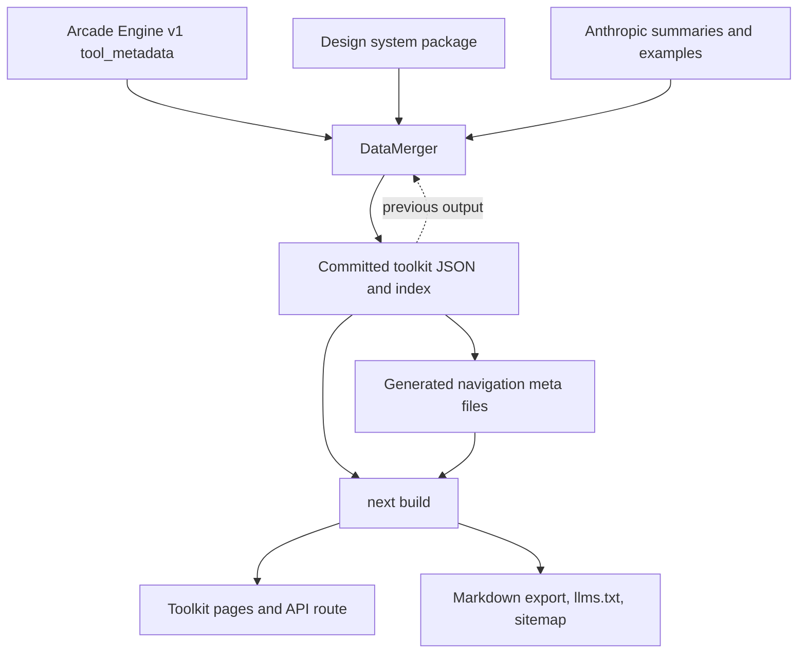

# Toolkit docs generator architecture

This document explains where toolkit documentation data comes from, how the generator
assembles it, and how the docs site renders it.

## Overview

The generator builds one JSON file per toolkit from several sources and commits them to
`data/toolkits/`. The docs site reads those committed files and renders them into pages at
build time.

The generator does **not** render HTML, and it does **not** run during a Vercel build. The
nightly workflow commits JSON and navigation changes through a pull request; Vercel then
runs the root `pnpm build` and compiles the committed files with Next.js. That separation is
deliberate — a docs deploy never depends on the Engine being reachable.

## Pipeline

The dotted edge is the most important thing on this diagram: **the output directory is also
an input.** See [Source-of-truth rules](#source-of-truth-rules).

## Where each field comes from

Roughly 117 toolkits and 8,000 tools, refreshed nightly at 11:00 UTC and on
`porter_deploy_succeeded`.

| Field | Source | Changes when |
|---|---|---|
| `tools[].name`, `description`, `parameters`, `output`, `secrets` | Arcade Engine | Engine deploys a toolkit |
| `tools[].auth.providerId`, `providerType`, `scopes` | Arcade Engine | same |
| `tools[].metadata.behavior` (`readOnly`, `destructive`, `idempotent`, `openWorld`) | Arcade Engine | same |
| `version` | Arcade Engine — parsed from `fullyQualifiedName` after the `@` | same |
| `description` (toolkit) | Arcade Engine — `tools[0].toolkitDescription ?? tools[0].description` | same |
| `label` | design system, falling back to the toolkit description, then a humanized id | dependency bump |
| `metadata.category`, `iconUrl`, `type`, `isPro`, `isBYOC`, `isComingSoon`, `isHidden`, `docsLink` | design system | dependency bump |
| **the page URL** | derived from `metadata.category` + the last segment of `docsLink` | dependency bump |
| `summary` | Anthropic, keyed on `buildToolkitSummarySignature` | toolkit signature changes |
| `tools[].codeExample`, `secretsInfo` | Anthropic, keyed on `buildComparableToolSignature` | tool signature changes |
| `documentationChunks`, `customImports`, `subPages` | **hand-authored, stored only in the committed JSON** | a human edits the file |

`buildComparableToolSignature` deliberately ignores descriptions and normalizes enum and
output representations, so cosmetic upstream churn does not trigger LLM regeneration.

When the design system has no entry for a toolkit, `getDefaultMetadata` supplies a
placeholder. Every field in it is a guess rather than a fact, so it forces `isHidden: true`
and nothing routes to it, and `--require-complete` — which the nightly workflow passes —
turns the omission into a failure that names the toolkit.

## Source-of-truth rules

These are the constraints that are not obvious from reading any single file.

### The committed JSON is the system of record for hand-authored prose

`documentationChunks`, `customImports`, and `subPages` have no upstream source. The
generator supports loading them from a file (`--custom-sections`), but the nightly workflow
does not pass that flag, so on every run the custom-sections source is empty and these
fields survive only because the merger carries the previous value forward when the incoming
value is empty (`mergeCustomSectionsArrays` in `src/merger/data-merger.ts`).

Consequences to respect when changing the generator:

- **Anything that disables previous-output loading discards prose.** `--force-regenerate`
  and `--overwrite-output` both set the previous-output directory to `undefined`, which
  removes the only copy of this content from the run. `--force-regenerate` is documented as
  refreshing examples and summaries; dropping prose is a side effect, not an intent.
- `src/diff/previous-output.ts` carries these three fields forward **even when the previous
  file fails schema validation**, for the same reason. That leniency is what keeps a schema
  mismatch from wiping prose, and should not be "cleaned up" without first giving prose
  another home.

### One schema, imported by both halves

`src/shared/toolkit-schemas.ts` holds the Zod definitions for the output format. The
generator validates against them on write and the docs site validates against them on read,
so there is no second hand-written description of the same data to drift against. The app's
types are `z.infer` of those schemas, and `src/shared/toolkit-primitives.ts` holds the id,
slug, and category helpers both halves share.

### A design-system bump can move page URLs

`metadata.category` and `metadata.docsLink` come from `@arcadeai/design-system`, which is a
pinned dependency. A version bump is therefore a routing change: recategorizing a toolkit
changes its canonical URL and needs a redirect. Review metadata diffs before bumping it.

A category the site does not recognize is a build failure, not a fallback. There is no
`others` catch-all — `normalizeCategory` throws, because every category needs a matching
route directory, and silently absorbing an unknown one produced clickable catalog cards
pointing at pages that could not exist.

### Toolkits are derived from tools, not listed

There is no "list toolkits" call. `fetchAllToolkitsData` fetches every tool and groups by
the first segment of `qualifiedName`, so a toolkit exists only if it has at least one tool.
`/v1/tool_metadata_summary` does return an authoritative toolkit list with per-toolkit tool
counts; `fetchToolkitsSummary` implements it but nothing calls it today.

### Absence and corruption are different failures

A missing file is normal — an optional toolkit, and the reader returns `null`. A file that
is present but unparseable or schema-invalid is a defect that fails the build, because this
data arrives through an automated pull request where a silent page deletion would ship.
Both halves enforce this: `src/generator/output-verifier.ts` reports read, syntax, and
schema errors distinctly on write, and `app/_lib/toolkit-data.ts` throws with the file path
and the underlying issue on read.

## Core components

### Data sources

- `EngineApiSource` — tool definitions from `GET /v1/tool_metadata`, paginated at 1000 per
  page, Bearer auth. Selected by `--api-source tool-metadata`; this is what CI uses.
- `ArcadeApiSource` — tool definitions from `GET /v1/tools`. Different response schema, no
  server-side toolkit filtering. Selected by `--api-source list-tools`.
- `DesignSystemMetadataSource` — toolkit metadata from `@arcadeai/design-system`. Matching is
  by normalized id with a `*Api` → provider-id fallback.
- `CustomSectionsFileSource` — hand-authored chunks from a JSON file, when `--custom-sections`
  is supplied.
- `CombinedToolkitDataSource` — joins tools and metadata behind one interface, so the rest of
  the pipeline does not know they are separate sources.
- Mock equivalents (`src/sources/mock-*.ts`) back `--api-source mock`, which needs no Engine
  or Anthropic credentials and is the right way to exercise the pipeline locally.

Two toolkit lists control what gets processed, and they are not synonyms:
`skip-toolkits.txt` (`--ignore-file`) skips a toolkit and leaves any previously generated
output in place; `remove-toolkits.txt` (`--exclude-file`) skips it **and** deletes its
output file.

### Merger

`DataMerger` builds `MergedToolkit` objects from tools, metadata, and custom sections. It
also computes tool signatures for change detection, generates examples and summaries through
the LLM, runs the secret-coherence scan, and collects warnings, failed tools, and which
toolkits fell back to placeholder metadata.

### Generator

`JsonGenerator` writes `<toolkitId>.json` per toolkit plus `index.json`, using atomic
writes and rejecting unsafe or colliding filenames. `OutputVerifier` re-reads the output
directory and validates it.

### Diffing

`ToolkitDiff` compares new output against previous output and reports new, removed,
modified, and version-only changes. `--skip-unchanged` uses it to regenerate only what
changed, which is what keeps the nightly pull request reviewable.

## Rendering in the docs site

- `app/_lib/toolkit-data.ts` reads the committed JSON for page rendering and for the
  `/api/toolkit-data/[toolkitId]` route. `loadAllToolkitData` is wrapped in React's `cache()`
  so a build reads the directory once and every caller shares one map.
- `app/_lib/toolkit-static-params.ts` enumerates routes from `index.json` and the per-toolkit
  files, and disables unknown dynamic parameters.
- Pages live at `/en/resources/integrations/<category>/<slug>` behind a `[toolkitId]` dynamic
  route per category, and prerender to static HTML at build time.
- Initial HTML carries a stripped summary; per-tool detail is fetched from
  `/api/toolkit-data/[toolkitId]` on expand, which keeps the largest reference pages under
  Googlebot's 2 MB crawl limit.
- `documentationChunks` are rendered as MDX. Two consumers implement the
  location/position injection model: `documentation-chunk-renderer.tsx` for the page and
  `app/_lib/toolkit-markdown.ts` for the markdown export. Both must stay in agreement.

If you need HTML output from the generator, add a separate build step in the app. The
generator intentionally avoids HTML to keep the pipeline deterministic.

## Search indexing

Search uses an external Algolia crawler. There is no Pagefind or local search index build
step in this repository. After deployment, the crawler indexes the rendered site.
`app/_components/algolia-search.tsx` queries that index with the public, read-only values
configured through these Vercel environment variables:

- `NEXT_PUBLIC_ALGOLIA_APP_ID`
- `NEXT_PUBLIC_ALGOLIA_SEARCH_API_KEY`
- `NEXT_PUBLIC_ALGOLIA_INDEX_NAME`

## Key files

- `src/shared/toolkit-schemas.ts` — the output contract, imported by generator and app
- `src/shared/toolkit-primitives.ts` — shared id, slug, and category helpers
- `src/shared/toolkit-data-dir.ts` — data directory resolution (Node-only, kept separate so
  it never enters a client component's import graph)
- `src/sources/engine-api.ts` — tool metadata from the Engine
- `src/sources/toolkit-data-source.ts` — unified data source
- `src/merger/data-merger.ts` — merge pipeline, signatures, carry-forward
- `src/diff/previous-output.ts` — lenient re-parse of committed output
- `src/generator/json-generator.ts` — output writer
- `src/generator/output-verifier.ts` — output validation
- `src/diff/toolkit-diff.ts` — change detection
- `src/cli/index.ts` — CLI entry point
- `scripts/sync-toolkit-sidebar.ts` — writes the integrations `_meta.tsx` navigation
